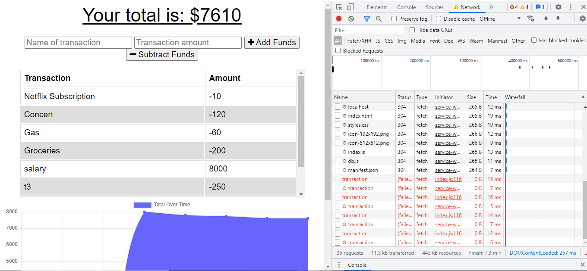

<h1>Budget Tracker </h1>
  
 
## Description
This web app will allow you to keep track of your budget and let you make additions or substractions whenever youre online or offline.
Live page: http://morning-caverns-38992.herokuapp.com/
## Table of Contents
- [Description](#description)
- [Installation](#installation)
- [Usage](#usage)
- [License](#license)
- [Contributing](#contributing)
- [Questions](#questions)
## Installation
* npm i
## Usage
* To use the app you just need enter the name of a transaction, its value and wether it will be an addition or a substraction.
 
Offline functionality: 

Online Functionality:

## License

 
This application is covered by the MIT license. 
## Contributing

## Contact:
 
Find me on GitHub: [adelalama](https://github.com/adelalama) 
 
Email me for any questions:: delalama.7@gmail.com  
    